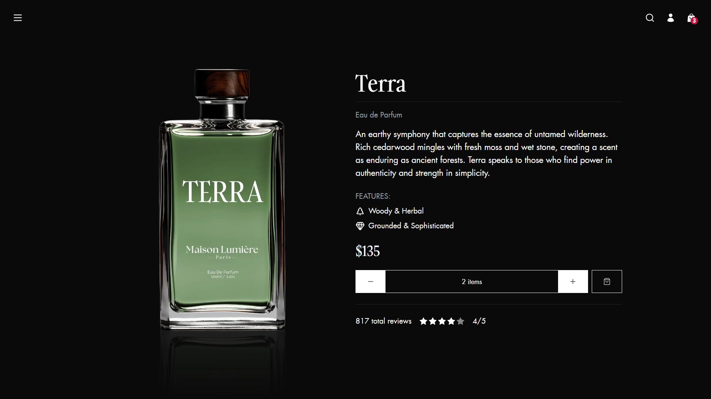

# Maison Lumière

Maison Lumière is a modern fragrance brand that combines elegance and innovation to deliver an immersive online shopping experience. [View Demo](https://maison-lumiere-pi.vercel.app/) 🌐



## Features

- 🎨 Modern and responsive design
- 🛒 fully functional shopping cart
- 🔰 Smooth animations with GSAP
- 🦄 Seamless navigation using the View Transition API
- ⚡️ Optimized images with lazy loading
- 🎯 Fully TypeScript enabled
- 🎨 TailwindCSS for styling
- 🚀 Focused on performance and accessibility

## Performance Insights

Below is a Lighthouse report showcasing the website's excellent scores in key areas such as performance, accessibility, best practices, and SEO.


## Tech Stack

- **Next.js**

- **GSAP**

- **View Transition API**

- **Tailwind CSS**

- **Zustand**

## Project Structure

```plaintext
- src/
  - app/
    - globals.css
    - layout.tsx
    - page.tsx
    - fragrance/[name]/page.tsx
  - components/
    - animations/
    - cart/
    - sections/
      - Fragrance/
    - shared/
    - ui/
  - hooks/
  - lib/
- public/
  - background.mp4
  - favicon.svg
  - fonts/
  - img/
```

## Installation

1. Clone the repository:

   ```bash
   git clone https://github.com/EL-OUARDY/maison-lumiere.git
   ```

2. Navigate to the project directory:

   ```bash
   cd maison-lumiere
   ```

3. Install dependencies:

   ```bash
   npm install
   ```

4. Run the development server:

   ```bash
   npm run dev
   ```

5. Open your browser and visit `http://localhost:3000` to view the application.
